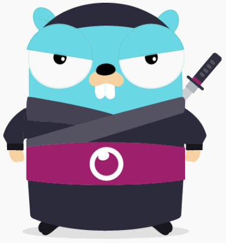

# eyeson go library

A golang client for the [eyeson video conferencing
API](https://docs.eyeson.com/docs/rest/eyeson-overview/).



## Usage

```golang
// Get your api-key at https://docs.eyeson.com/docs/rest/eyeson-api#how-to-obtain-an-eyeson-api-key
client, err := eyeson.NewClient(eyesonApiKey)
room, err := client.Rooms.Join("standup meeting", "mike")
room.Links.Gui // https://app.eyeson.team/?sessionToken URL to eyeson web GUI
err = room.WaitReady()
overlayUrl = "https://eyeson-team.github.io/api/images/eyeson-overlay.png"
// Set a foreground image.
err = room.SetLayer(overlayUrl, eyeson.Foreground)
// Send a chat message.
err = room.Chat("Welcome!")
```

In order to receive events from the running meeting, connect
on the observer socket like this:

```golang
client, _ := eyeson.NewClient(eyesonApiKey)
room, _ := client.Rooms.Join("standup meeting", "mike")
msgCh, _ := client.Observer.Connect(context.Background(), room.Data.Room.ID)
for {
	select {
	case msg, ok := <-msgCh:
		if !ok {
			fmt.Println("Channel closed. Probably disconnected")
			return
		}
		fmt.Println("Received event type: ", msg.GetType())
		switch m := msg.(type) {
		case *eyeson.Chat:
			fmt.Printf("Chat: %s - %s\n", m.ClientID, m.Content)
		}
	}
}
```

## Development

```sh
make test # run go tests
# run an example program that starts a meeting, adds an overlay and sends
# a chat message.
API_KEY=... go run examples/meeting.go
# run an example program that listens for webhooks. please ensure the endpoint
# is public available.
API_KEY=... go run examples/webhook-listener.go <endpoint-url>
```

## Releases

-  1.3.0 Add Observer functionality
- master Add Webhook signature
-  1.1.1 Add Shutdown, Fix Webhook Response Validation
-  1.1.0 Add Webhook Handling
-  1.0.0 Initial Release
